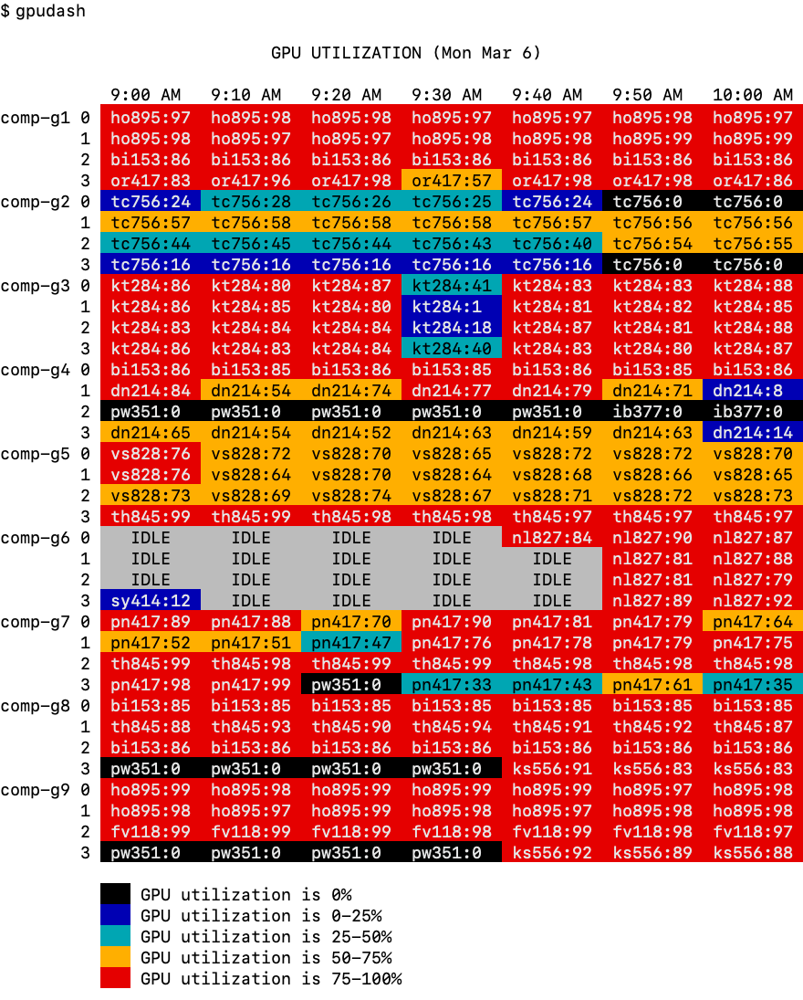
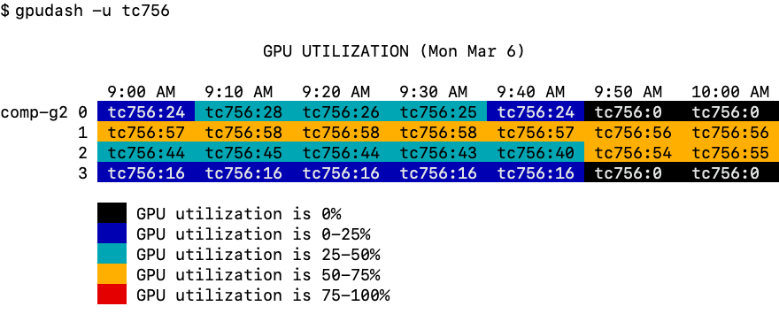

# gpudash

The `gpudash` command is part of the [Jobstats platform](https://github.com/PrincetonUniversity/jobstats). The `gpudash` command displays a GPU utilization dashboard for the last hour:

<p align="center">
  
</p>


The dashboard can be generated for a specific user:



Here is the help menu:

```
usage: gpudash [-h] [-u NETID] [-n] [-c]

GPU utilization dashboard for the last hour

optional arguments:
  -h, --help       show this help message and exit
  -u NETID         create dashboard for a single user
  -n, --no-legend  flag to hide the legend
  -c, --cryoem     flag to show cryoem nodes

Utilization is the percentage of time during a sampling window (< 1 second) that
a kernel was running on the GPU. The format of each entry in the dashboard is
username:utilization (e.g., aturing:90). Utilization varies between 0 and 100%.

Examples:

  Show dashboard for all users:
    $ gpudash

  Show dashboard for the user aturing:
    $ gpudash -u aturing

  Show dashboard for all users without displaying legend:
    $ gpudash -n

  Show dashboard for the cryoem nodes:
    $ gpudash -c

  Show dashboard for the cryoem nodes for user aturing:
    $ gpudash -c -u aturing
```

## Getting Started

The `gpudash` command buiilds on the [Jobstats platform](https://github.com/PrincetonUniversity/jobstats). To run the software it requires Python 3.6+ and version 1.17+ of the Python `blessed` package.

### 1. Create a script to pull data from Prometheus

```bash
$ cat query_prometheus.sh
#!/bin/bash

DATA="/home/jdh4/bin/gpus/data"
PROM_SERVER='http://vigilant2.sn17:8480/api/v1/query?query='
printf -v SECS '%(%s)T' -1

curl -s 'http://vigilant2.sn17:8480/api/v1/query?query=nvidia_gpu_duty_cycle' > ${DATA}/util.${SECS}
curl -s 'http://vigilant2.sn17:8480/api/v1/query?query=nvidia_gpu_jobUid'     > ${DATA}/uid.${SECS}
curl -s 'http://vigilant2.sn17:8480/api/v1/query?query=nvidia_gpu_jobId'      > ${DATA}/jobid.${SECS}

# remove any data files that are greater or equal to 70 minutes old
find ${DATA} -type f -mmin +70 -exec rm -f {} \;

# extract the data from the Prometheus files
/usr/licensed/anaconda3/2022.5/bin/python /home/jdh4/bin/gpus/extract.py
```

### 2. Create an entry in crontab

```
0,10,20,30,40,50 * * * * /path/to/query_prometheus.sh > /dev/null 2>&1
```

### 2a. Get the UID and username

### 3. Extract the data from the Prometheus files

With these steps in place, you can use the `gpudash` command:

```
$ gpudash
```

## Getting Help

Please post an issue on this repo. Extensions to the code are welcome.
